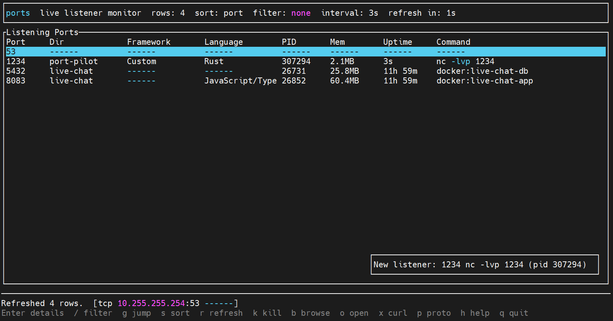

<a id="top"></a>

# Table of Contents
- [Description](#description)
- [Main Features](#main-features)
- [Tech Stack](#tech-stack)
- [Getting Started](#getting-started)
- [Command Reference](#command-reference)
- [TUI](#tui)
- [Detection Heuristics](#detection-heuristics)
- [Cross-Platform Notes](#cross-platform-notes)
- [Development](#development)
- [Docs Page](#docs-page)

## Description

`ports` is a developer-first CLI for seeing what is listening on your machine, where it came from, and what to do about it.

It combines:

- A live terminal UI when you run `ports`
- Fast shell commands for `list`, `check`, and `kill`
- Process enrichment for directory, framework, language, memory, uptime, PID, command, and framework version when detectable
- A one-page static docs page in [`docs/guide.html`](docs/guide.html)

The primary table shape is intentionally consistent. When metadata cannot be resolved, `ports` renders `------` instead of leaving the output uneven or ambiguous.

### TUI View


[Back to top](#top)

## Main Features

- `ports` opens a ratatui-based live TUI that refreshes every 3 seconds by default and supports `--interval <seconds>`
- `ports list` and `ports ls` print a static colorized table of listening ports
- `ports check <port>` shows detailed information for one port or reports that it is free
- `ports kill <port>` tries graceful termination first, then force-kills if needed
- `ports help <topic>` shows focused help for a command or switch
- `ports --json list` and `ports --json check <port>` emit machine-readable JSON for automation
- The TUI includes sorting, filtering, port jump, detail view, browser open, directory open, kill, and curl-snippet actions
- New-listener events appear as a lower-right toast in the TUI instead of being lost in a single refresh-cycle footer update
- TUI rows dim system-owned processes and highlight high-memory rows in red
- Unix builds prefer the `listeners` crate for socket discovery and fall back to `lsof` when necessary
- Linux and Windows builds add a host-listener fallback so open ports still appear when PID ownership is unavailable
- Docker-published ports are labeled when Docker is reachable, but Docker access is best-effort only
- Docker Compose ports inherit project/framework detection from the compose working directory when that host path is available
- Standalone Docker containers infer framework and command details from image metadata and runtime commands
- Kubernetes-managed containers inherit pod/container identity when runtime labels expose it
- containerd-managed containers are enriched from `ctr` metadata when the runtime is reachable
- Process metadata comes from `sysinfo`, with `procfs` used on Linux for extra cwd coverage

[Back to top](#top)

## Tech Stack

- Rust
- `clap`
- `ratatui`
- `crossterm`
- `owo-colors`
- `listeners`
- `sysinfo`
- `procfs` on Linux

[Back to top](#top)

## Getting Started

### Build

```bash
cargo build
```

### Run

```bash
cargo run
```

### Common Commands

```bash
# open the live TUI
cargo run

# print a static table
cargo run -- ls

# print JSON
cargo run -- --json ls

# inspect a single port
cargo run -- check 3000

# inspect a single port as JSON
cargo run -- --json check 3000

# open the TUI with a 5-second refresh interval
cargo run -- --interval 5

# kill whatever is on a port
cargo run -- kill 3000

# command-specific help
cargo run -- help kill
```

[Back to top](#top)

## Command Reference

### `ports`

Launch the interactive TUI.

Options:

- `--interval <seconds>` sets the refresh interval for the TUI

### `ports list`

Print a static table of listening ports.

Alias:

- `ports ls`

Options:

- `--json` prints the table as structured JSON

### `ports check <port>`

Show detailed information for a port, including:

- PID
- Directory
- Framework
- Language
- Memory
- Uptime
- Command
- Command line
- Addresses
- Executable path

If nothing is listening there, it prints `Port <n> is free.`

Options:

- `--json` prints the result as structured JSON

### `ports kill <port>`

Kill every process listening on the given port.

Behavior:

- Graceful stop first
- Forced termination if the process does not exit
- Non-zero exit if nothing was listening or no target could be stopped

### `ports help <topic>`

Show focused help for:

- `list`
- `ls`
- `check`
- `kill`
- `-h`
- `--help`

[Back to top](#top)

## TUI

Running `ports` with no arguments opens the live interface.

The header shows:

- Row count
- Active sort
- Active filter
- Active interval
- Refresh countdown

The main table shows:

- Port
- Dir
- Framework
- Language
- PID
- Mem
- Uptime
- Command

The footer shows live status and selected-row metadata.

The lower-right notification toast shows newly detected listeners and persists briefly across refreshes so short-lived notifications remain visible.

The bottom line always shows compact keyboard shortcuts such as `Enter details`, `/ filter`, `g jump`, and `q quit`.

Sort modes cycle through:

- Port
- Memory
- Uptime
- Dir

### TUI Shortcuts

- `Up` / `Down` moves the selection
- `Enter` toggles the detail view
- `/` enters filter mode
- `g` jumps to a port number
- `s` cycles sort mode
- `r` refreshes immediately
- `k` kills the selected port
- `b` opens `http://127.0.0.1:<port>` in a browser
- `o` opens the selected working directory
- `x` shows a ready-to-run curl snippet in the status bar
- `p` toggles the protocol/address footer details
- `h` toggles the shortcuts overlay
- `Esc` closes overlays and never exits the TUI
- `q` quits

[Back to top](#top)

## Detection Heuristics

`ports` uses deterministic heuristics to identify likely frameworks, versions, and languages.

Signals include:

- Executable names like `node`, `python`, `ruby`, `php`, `java`, `go`, `cargo`, and `dotnet`
- Command fragments like `next dev`, `vite`, `uvicorn`, `rails`, `axum`, and `actix`
- Project markers such as `package.json`, `Cargo.toml`, `pyproject.toml`, `requirements.txt`, `Gemfile`, `go.mod`, `composer.json`, `pom.xml`, `build.gradle`, `next.config.*`, and `vite.config.*`
- Version manifests such as `package.json`, `Cargo.toml`, `pyproject.toml`, `Gemfile.lock`, `composer.json`, and common Spring manifests

[Back to top](#top)

## Cross-Platform Notes

- The project is designed for Linux, macOS, and Windows
- Listener discovery uses `listeners` as the primary backend
- Unix builds fall back to `lsof` if listener enumeration fails
- Linux and Windows builds add a broader host-level fallback: `ss` on Unix-like systems and `netstat` on Windows
- Linux builds also use `procfs` for better cwd resolution
- Some fields depend on OS permissions and process visibility, especially on Windows

[Back to top](#top)

## Development

### Format

```bash
cargo fmt
```

### Default Verify

```bash
scripts/verify.sh
```

### Test

```bash
cargo test
```

### Linux Release Build

```bash
cargo build --release
```

The native Linux binary is written to `target/release/ports`.

Running `scripts/build-release-binaries.sh` also creates normalized release artifacts in `target/release`:

- `target/release/ports-linux-amd64`
- `target/release/ports-windows-amd64.exe`
- `target/release/ports-darwin-amd64`

Cross-target release builds stay in Cargo's standard target directories, for example:

- `target/x86_64-pc-windows-msvc/release/ports.exe`
- `target/x86_64-apple-darwin/release/ports`

The test suite includes:

- Unit tests for formatting and detection logic
- TUI state tests
- Integration tests for `list`, `check`, and `kill` against a temporary listening process

[Back to top](#top)

## Docs Page

The project includes a static one-page reference page inspired by a cheatsheet layout:

- [`docs/guide.html`](docs/guide.html)

[Back to top](#top)

<p align="center"><sub>Vibe-Coded with &#x2665;&#xFE0E;</sub></p>
